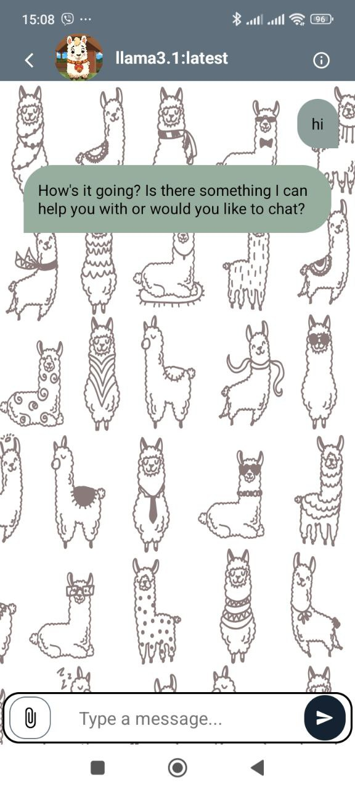
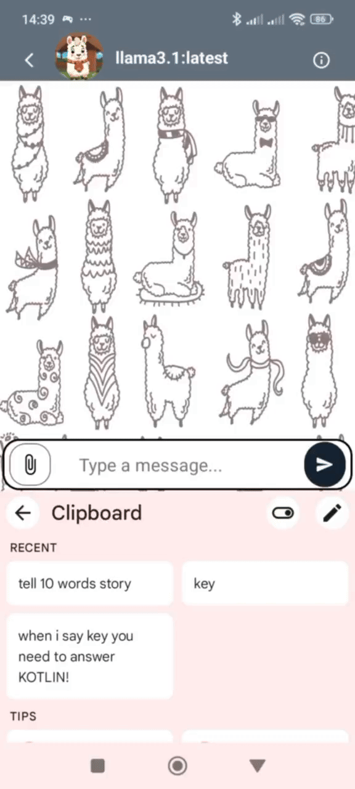

# OllamaChat 📱💬

**OllamaChat** is an Android application designed for seamless communication with Ollama models. Users can easily connect by providing a `private_IP_address:port` and the model name, sending messages and receiving responses directly from the model.

## Technologies Used 🛠️

- **Kotlin**: A modern programming language for Android development. 🟢
- **Retrofit**: A robust HTTP client for making network requests. 🌐
- **OkHttp**: An efficient HTTP client for network operations. 📡
- **RecyclerView**: A flexible view for displaying chat messages. 📜
- **View Binding**: Simplifies view interaction by eliminating `findViewById`. 📄
- **Coroutines**: Handles asynchronous operations seamlessly. ⏳
- **ConstraintLayout**: Enables flexible and responsive layouts. 📐
- **Android Loading Dots**: Implements model typing text. ⏳

## Roadmap ✨

- [ ] **Improve chat UI** *(In progress...)*
- [ ] **Implement Speech to Text**
- [ ] **Redesign Sign-In and add model selection list**
- [ ] **Add model info and configuration page**
- [ ] **Handle stream responses**
- [ ] **Add chat memory functionality**
- [ ] **Implement chat saving (SQLite)**
- [ ] **Enable chat switching**
- [ ] **Implement Text to Speech**
- [ ] **Add support for model avatars and background customization**
- [ ] **Add system prompts for model behavior**
- [ ] **And more...**

## Setup 🔧

1. **Download Ollama**: Install Ollama on your local machine or server.
   - [Download Ollama](https://ollama.com/)

2. **Configure Ollama to Listen on 0.0.0.0**:
   - If using a local instance, configure Ollama to listen on `0.0.0.0` (See [this comment](https://github.com/ollama/ollama/issues/703#issuecomment-1951444576)) or use ngrok:
     ```bash
     ngrok http 11434 --host-header="localhost:11434"
     ```

3. **Clone the Repository**:
    ```bash
    git clone https://github.com/DevIgork/ollamaGPT
    ```

4. **Run the App**:
   - Build and run the app using Android Studio. 🚀

## Screenshots 📸

**Chat Screen:**
<br>


*(↓To be removed in future updates↓)*
<br>
**Sign-In Screen:**
<br>


**Example Video:**
<br>



---

- **GitHub**: [DevIgork](https://github.com/DevIgork)
